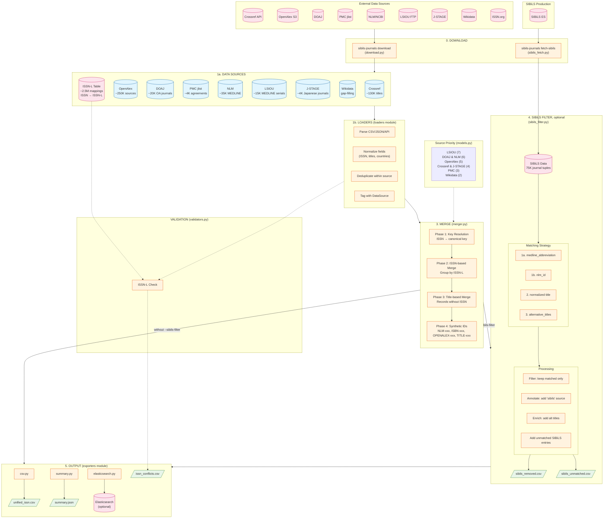

# SIBiLS Journals

Journal repository for SIBiLS - merges journal data from multiple sources.

## Python API

### Import normalized functions

```python
from sibils_journals import (
    JournalDict,
    normalize_issn,
    normalize_country,
    normalize_language,
    normalize_license,
    normalize_review_process,
)

# Use normalizers
issn = normalize_issn("1234-5678")
country = normalize_country("United States")  # Returns "US"
language = normalize_language("English")  # Returns ["en"]
license = normalize_license("CC BY")  # Returns "CC-BY-4.0"
```

### Create journal records

```python
from sibils_journals import JournalDict, serialize_journal

record: JournalDict = {
    "issn_l": "1234-5678",
    "title": "Test Journal",
    "publisher": "Test Publisher",
    "country": "US",
    "language": ["en"],
    "license": "CC-BY-4.0",
    "sources": ["doaj"],
}

# Convert to serializable dict for CSV/DataFrame
serialized = serialize_journal(record)
```

### Unify journals from multiple sources

```python
from sibils_journals import (
    load_issn_l_table,
    load_doaj_data,
    load_crossref_data,
    unify_journals,
)

# Load ISSN-L mapping
issn_l_map = load_issn_l_table(input_dir)

# Load data from sources
journals = []
journals.extend(load_doaj_data(input_dir))
journals.extend(load_crossref_data(input_dir))

# Unify into single DataFrame
df = unify_journals(journals, issn_l_map)
```

## Package Structure

```
sibils_journals/
├── __init__.py                    # Public API exports
├── __main__.py                    # CLI entry point with subcommands
├── config.py                      # Configuration and paths
├── download.py                    # Download data from sources
├── unify.py                       # Unify downloaded data
├── models.py                      # JournalDict TypedDict + constants
├── metrics.py                     # QualityMetrics tracking
├── merger.py                      # Journal unification logic
├── stats.py                       # Statistics generation
├── sibils_fetch.py                # Fetch journal data from SIBiLS Elasticsearch
├── sibils_filter.py               # Filter/match unified data against SIBiLS
├── validators.py                  # ISSN-L consistency validation
├── normalizers/
│   ├── __init__.py               # Export all normalize_* functions
│   ├── identifiers.py            # ISSN validation and normalization
│   ├── text.py                   # Text normalization
│   ├── geography.py              # Country normalization (ISO 3166-1)
│   ├── languages.py              # Language normalization (ISO 639-1)
│   ├── licenses.py               # License normalization (SPDX)
│   ├── subjects.py               # Subject/discipline normalization
│   ├── review_process.py         # Review process normalization
│   ├── preservation.py           # Preservation service normalization
│   ├── deposit_policy.py         # Deposit policy normalization
│   └── utils.py                  # Shared normalizer utilities
├── loaders/
│   ├── __init__.py               # Export all load_* functions
│   ├── issn.py                   # ISSN-L table loader
│   ├── crossref.py               # Crossref data
│   ├── openalex.py               # OpenAlex data
│   ├── pmc.py                    # PMC journal list (deposit agreements)
│   ├── doaj.py                   # DOAJ data
│   ├── nlm.py                    # NLM Catalog data
│   ├── lsiou.py                  # LSIOU (MEDLINE serials with relationships)
│   ├── jstage.py                 # J-STAGE (Japanese journals)
│   ├── wikidata.py               # Wikidata SPARQL (gap-filling)
│   └── utils.py                  # Shared loader utilities
└── exporters/
    ├── __init__.py               # Export all export functions
    ├── csv.py                    # CSV export
    ├── summary.py                # Summary/statistics export
    └── elasticsearch.py          # Elasticsearch export
```

## Data Pipeline


